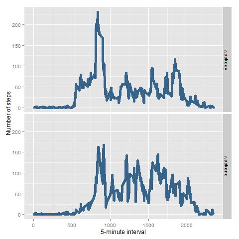

## Loading and preprocessing the data
The activity data is available in .zip format. It is uncompressed and loaded in R with the following code. 

```
library(knitr)
library(markdown)
library(ggplot2)
pedometer2 <- read.csv("./reproducible_research_exercise/activity.csv", header = TRUE, sep = ",")
```


## What is mean total number of steps taken per day?
### Step 1: Calculate the total number of steps taken per day
```
total_steps_byday <- aggregate(pedometer2$steps, list(Date = pedometer2$date), sum)
colnames(total_steps_byday) <- c("Date", "Steps") ## rename columns. Date is a factor. Steps is an integer.
```

### Step 2:  Make a histogram of the total number of steps taken each day
```
ggplot(data=total_steps_byday, aes(total_steps_byday$Steps)) + geom_histogram(colour="black", fill="steelblue4") + xlab("Date") + ylab("Total No. Of Steps Taken Each Day") + ggtitle("Total No. of Steps Taken Each Day")
```


###  Step 3: Calculate and report the mean and median of the total number of steps taken per day
```
mean(total_steps_byday$Steps, na.rm=TRUE)
median(total_steps_byday$Steps, na.rm=TRUE)
```

Average number of steps per day is 10766.19.
Median number of steps per day is 10765.


## What is the average daily activity pattern?

### Make a time series plot (i.e. type = "l") of the 5-minute interval (x-axis) and the average number of steps taken, averaged across all days (y-axis)

```
dailyaverage<- aggregate(steps ~ interval, pedometer2, mean) ## ~ is read as "by"
ggplot(dailyaverage, aes(x=interval, y=steps)) + geom_line(color="blue", size=1) + labs(title="Average Daily Activity Pattern", x = "Intervals", y = "Number of steps") + theme_bw()
```


### Which 5-minute interval, on average across all the days in the dataset, contains the maximum number of steps?

```
max_interval <- dailyaverage[which.max(dailyaverage$steps),]
```

### Calculate the median of the average value of steps taken per day of the week.
```
median(dailyaverage$steps)
```

### Calculate and report the total number of missing values in the dataset (i.e. the total number of rows with NAs)
```
sum(is.na(pedometer2$steps))
```

### Devise a strategy for filling in all of the missing values in the dataset. The strategy does not need to be sophisticated. For example, you could use the mean/median for that day, or the mean for that 5-minute interval, etc.
```
new_dataset <- pedometer2 ## create new data set
nas <- is.na(new_dataset$steps) ## number of NAs in new dataset
avg_internal <- tapply(new_dataset$steps, new_dataset$interval, mean, na.rm=TRUE, simplify=TRUE)
```

### Create a new dataset that is equal to the original dataset but with the missing data filled in.
```
new_dataset$steps[nas] <- avg_internal[as.character(new_dataset$interval[nas])]
```

### Make a histogram of the total number of steps taken each day
```
ggplot(new_dataset, aes(x=interval, y=steps)) + geom_line(color="blue", size=1) + labs(title="Average Daily Activity Pattern", x = "Intervals", y = "Number of steps") + theme_bw()
```


## Inputing missing values
### Calculate and report the total number of missing values in the dataset (i.e. the total number of rows with NAs)
```
sum(is.na(pedometer2$steps))
```

### Devise a strategy for filling in all of the missing values in the dataset. The strategy does not need to be sophisticated. For example, you could use the mean/median for that day, or the mean for that 5-minute interval, etc.
```
new_dataset <- pedometer2 ## create new data set
nas <- is.na(new_dataset$steps) ## number of NAs in new dataset
avg_internal <- tapply(new_dataset$steps, new_dataset$interval, mean, na.rm=TRUE, simplify=TRUE)
```

### Create a new dataset that is equal to the original dataset but with the missing data filled in.
```
new_dataset$steps[nas] <- avg_internal[as.character(new_dataset$interval[nas])]
```

### Make a histogram of the total number of steps taken each day
```
ggplot(new_dataset, aes(x=interval, y=steps)) + geom_line(color="blue", size=1) + labs(title="Average Daily Activity Pattern", x = "Intervals", y = "Number of steps") + theme_bw()
```


## Are there differences in activity patterns between weekdays and weekends?
### Use the dataset with the filled-in missing values for this part.
```
weekday.or.weekend <- function(date) {
  day <- weekdays(date)
  if (day %in% c("Monday", "Tuesday", "Wednesday", "Thursday", "Friday"))
    return("weekday")
  else if (day %in% c("Saturday", "Sunday"))
    return("weekend")
  else
    stop("invalid date")
}
new_dataset$date <- as.Date(new_dataset$date)
new_dataset$day <- sapply(new_dataset$date, FUN=weekday.or.weekend)
```

### Create a new factor variable in the dataset with two levels - "weekday" and "weekend" indicating whether a given date is a weekday or weekend day.

### Make a panel plot containing a time series plot (i.e. type = "l") of the 5-minute interval (x-axis) and the average number of steps taken, averaged across all weekday days or weekend days (y-axis). See the README file in the GitHub repository to see an example of what this plot should look like using simulated data.

```
averages <- aggregate(steps ~ interval + day, data=new_dataset, mean)
ggplot(averages, aes(interval, steps)) + geom_line(color = "steelblue4", lwd = 2) + facet_grid(day ~ .) +
  xlab("5-minute interval") + ylab("Number of steps") + labs(title = expression("Fig 4"))
```


